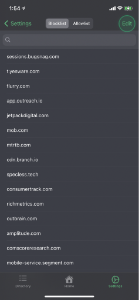

Every time you open a website or an app, trackers embedded in it make calls to the *domains* (a domain can be seen as an address for a website) of the companies that control them. The TulaByte app stops the operation of these trackers by blocking access to the *domains* they are trying to talk to. Yet how does the app know which domains to block? The answer is fairly simple; the TulaByte app uses a list of domains that are known to be used by trackers, called a **Blocklist**. The Blocklist is completely configurable by the user, although the app comes preinstalled with a curated list of the most common offenders. 

Some companies however attempt to thwart individuals who are attempting to take control of their digital privacy by linking tracking and badware domains to their main domain. By doing so, rudimentary Blocklist based tools can make using normal websites and apps impossible to use. To avoid this problem, TulaByte complements the Blocklist with an **Allowlist.** The Allowlist ensures that only trackers and badware are blocked, with the website or app being left unaffected. The TulaByte app also comes preinstalled with a curated Allowlist which works to ensure that your normal usage is not affected.

The default Blocklist and Allowlist covers the large majority of tracker and badware domains and is a reliable preset for most users. However, more advanced users may wish to fine-tune or even completely customise their lists. The TulaByte app thus gives users full control of the 2 lists through the **Modify Lists** page.

See below for how to guides on key features.
- [How to search the lists](#how-to-search-the-lists)
- [How to delete list items](#how-to-delete-list-items)
- [How to add a single domain to a list](#how-to-add-a-single-domain-to-a-list)
- [How to add multiple domains to a list](#how-to-add-multiple-domains-to-a-list)
- [How to reset a list](#how-to-reset-a-list)
- [How to clear a list](#how-to-clear-a-list)
- [How to move items between lists](#how-to-move-items-between-lists)

## How to search the lists
1. Open the **Modify Lists** page.
   
2. Choose the list you wish to edit from the given options.
   
3. Start typing in the search bar to see results updating.
   

## How to delete list items
1. Open the **Modify Lists** page.
   
2. Choose the list you wish to edit from the given options.
   
3. Long press a list item to see options.
4. Select **Delete** to remove the chosen domain from the list
   

## How to add a single domain to a list
1. Open the **Modify Lists** page.
   
2. Choose the list you wish to edit from the given options.
   
3. Tap the **Edit** button to open the menu.
   
4. Select the **Add Block URL** or **Add Allow URL** option.
   
5. Enter a single domain to add to the list.
6. Press **Add**.
   

## How to add multiple domains to a list
1. Open the **Modify Lists** page.
   
2. Choose the list you wish to edit from the given options.
   
3. Tap the **Edit** button to open the menu.
   
4. Select the **Add Block File** or **Add Allow File** option.
   
5. Select a valid file in the pop-up menu.
   
> A valid list is a plaintext (`.txt`) file with a single domain on each line.
6. The domains from the file will be added to the current list.

## How to reset a list
1. Open the **Modify Lists** page.
   
2. Choose the list you wish to edit from the given options.
   
3. Tap the **Edit** button to open the menu.
   
4. Select the **Reset Blocklist** or **Reset Allowlist** option.
   
5. Press **Reset** to perform the reset.
   
   
> This option resets the list to the TulaByte default. Any custom added domains will be lost.

## How to clear a list
1. Open the **Modify Lists** page.
   
2. Choose the list you wish to edit from the given options.
   
3. Tap the **Edit** button to open the menu.
   
4. Select the **Clear Blocklist** or **Clear Allowlist** option.
   
5. Press **Clear** to completely clear the list.
   

## How to move items between lists
1. Open the **Modify Lists** page.
   
2. Choose the list you wish to edit from the given options.
   
3. Long press a list item to see options.
4. Select **Move to Allowlist** or **Move to Blocklist** to move the domain.
   

